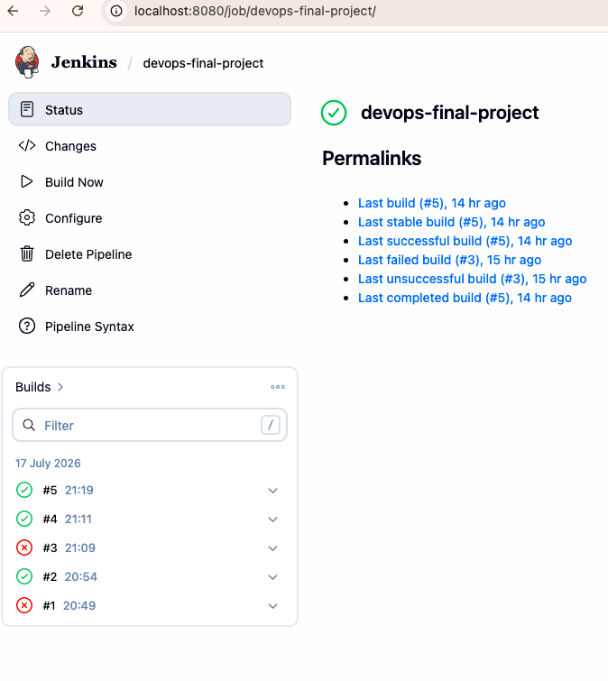
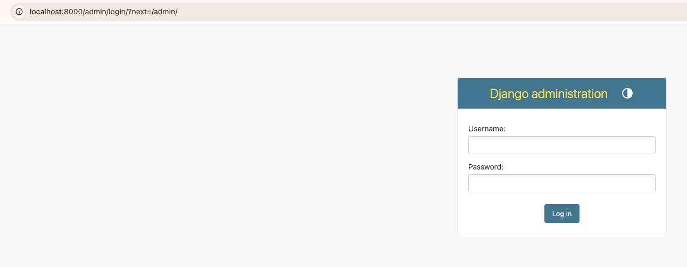
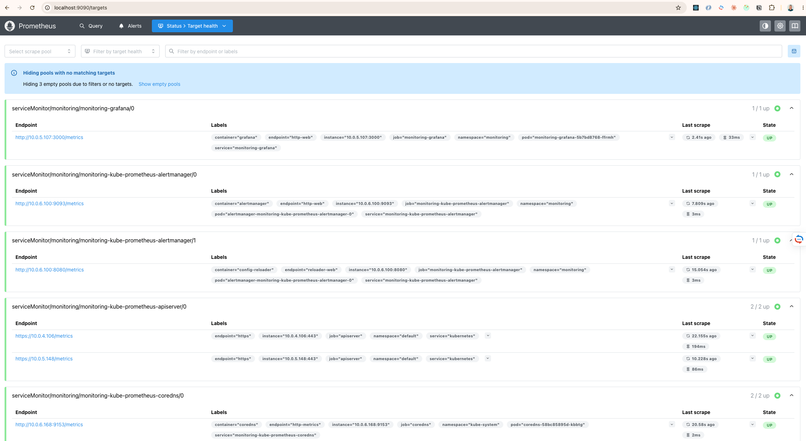
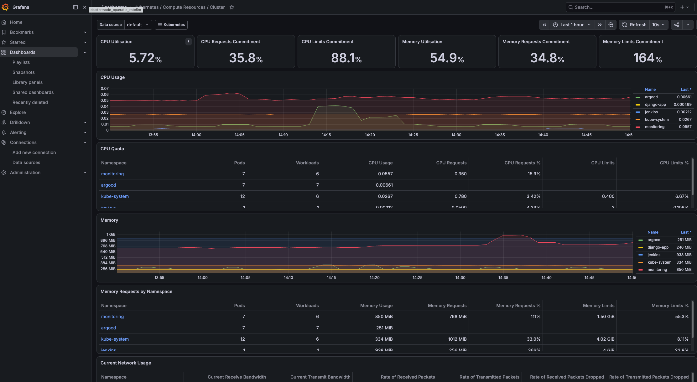
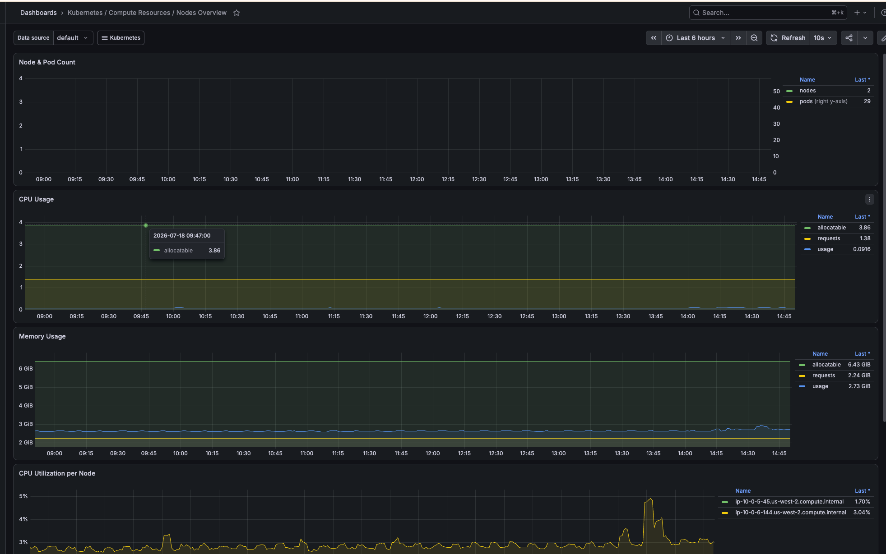
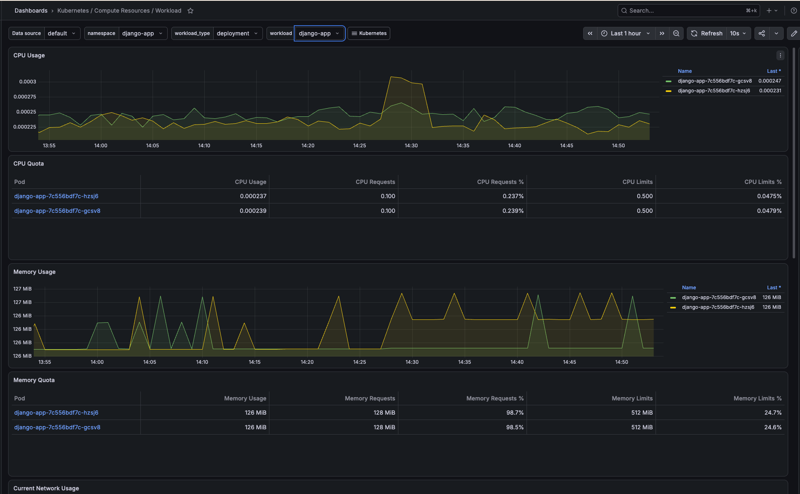
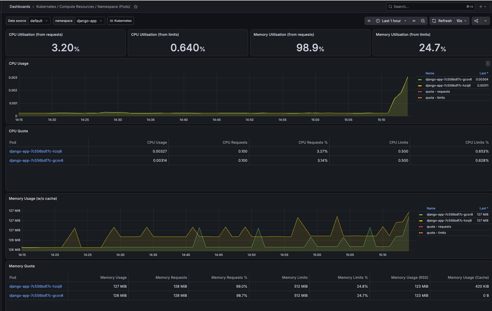
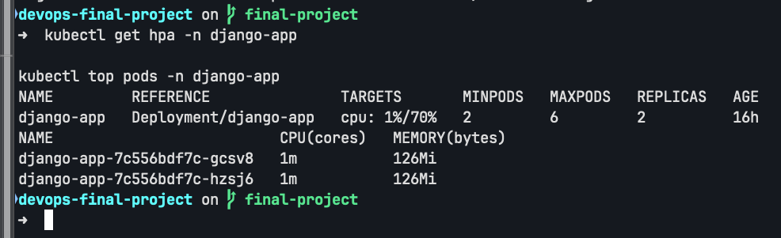

# DevOps Final Project

## 1. Опис проєкту

Проєкт розгортає контейнеризований Django-застосунок в AWS із використанням Terraform, Amazon EKS, Amazon ECR, Amazon RDS, Jenkins, Argo CD, Helm, Prometheus і Grafana.

Основний сценарій роботи:

```text
GitHub
  ↓
Jenkins
  ↓
Kaniko build
  ↓
Amazon ECR
  ↓
оновлення Helm values
  ↓
Argo CD
  ↓
Amazon EKS
  ↓
Django + Amazon RDS PostgreSQL
```

Гілка розгортання:

```text
final-project
```

AWS region:

```text
us-west-2
```

---

## 2. Архітектура

Інфраструктура поділена на три рівні:

### Bootstrap

Створює backend для Terraform state:

- Amazon S3;
- DynamoDB table.

### AWS infrastructure

Створює:

- VPC;
- public і private subnets;
- Internet Gateway;
- NAT Gateway;
- Amazon EKS;
- managed node group;
- Amazon ECR;
- Amazon RDS PostgreSQL;
- IAM roles і security groups.

### Platform

Встановлює в EKS:

- Jenkins;
- Argo CD;
- Prometheus;
- Grafana;
- Alertmanager;
- kube-state-metrics;
- node-exporter;
- metrics-server;
- Django Kubernetes Secret.

```text
AWS
├── VPC
│   ├── Public subnets
│   └── Private subnets
├── EKS
│   ├── Jenkins
│   ├── Argo CD
│   ├── Django
│   └── Monitoring
├── ECR
└── RDS PostgreSQL
```

---

## 3. Основні технології

- Terraform;
- AWS CLI;
- Amazon EKS;
- Amazon ECR;
- Amazon RDS PostgreSQL;
- Kubernetes;
- Helm;
- Jenkins;
- Kaniko;
- Argo CD;
- Docker;
- Django;
- Gunicorn;
- Prometheus;
- Grafana.

Під час виконання використовувалися:

```text
Terraform 1.15.8
AWS CLI 2.35.24
kubectl 1.36.1
Helm 4.2.3
Docker 29.6.1
```

---

## 4. Структура репозиторію

```text
.
├── app/                    # Django application і Dockerfile
├── bootstrap/              # Terraform backend
├── charts/django-app/      # Helm chart
├── modules/
│   ├── argo_cd/
│   ├── ecr/
│   ├── eks/
│   ├── jenkins/
│   ├── monitoring/
│   ├── rds/
│   ├── s3-backend/
│   └── vpc/
├── platform/               # Jenkins, Argo CD і monitoring
├── docs/screenshots/       # Докази роботи
├── Jenkinsfile
├── main.tf
├── backend.tf
├── providers.tf
├── variables.tf
└── outputs.tf
```

---

## 5. Налаштування

Перед запуском потрібно налаштувати AWS CLI:

```bash
aws configure
```

Перевірити активний AWS account:

```bash
aws sts get-caller-identity
```

Створити локальний файл:

```text
terraform.tfvars
```

на основі:

```text
terraform.tfvars.example
```

Після створення основної AWS-інфраструктури також потрібно створити:

```text
platform/terraform.tfvars
```

на основі:

```text
platform/terraform.tfvars.example
```

Локальні `tfvars`, Terraform state, `.env`, приватні ключі та архіви виключені з Git.

---

## 6. Розгортання

### 6.1. Terraform backend

```bash
terraform -chdir=bootstrap init
terraform -chdir=bootstrap plan
terraform -chdir=bootstrap apply
```

### 6.2. AWS infrastructure

```bash
terraform init
terraform plan
terraform apply
```

Після створення EKS потрібно оновити kubeconfig:

```bash
aws eks update-kubeconfig \
  --region us-west-2 \
  --name devops-final-project-eks
```

Перевірка:

```bash
kubectl get nodes
kubectl get pods -A
```

### 6.3. Platform layer

```bash
terraform -chdir=platform init
terraform -chdir=platform plan
terraform -chdir=platform apply
```

---

## 7. Django та Kubernetes

Django image базується на:

```text
python:3.11-slim
```

Застосунок запускається через Gunicorn:

```text
gunicorn config.wsgi:application
```

Основні Kubernetes-ресурси:

- Deployment;
- Service типу `LoadBalancer`;
- ConfigMap;
- Secret;
- HorizontalPodAutoscaler;
- migration Job.

Параметри HPA:

```text
min replicas: 2
max replicas: 6
target CPU: 70%
```

Міграції запускаються як Argo CD `PreSync` hook:

```text
python manage.py migrate --noinput
```

Django підключається до приватного Amazon RDS PostgreSQL.

---

## 8. CI/CD і GitOps

Pipeline описаний у `Jenkinsfile`.

Jenkins виконує:

1. checkout гілки `final-project`;
2. формування image tag із короткого Git SHA;
3. build Docker image через Kaniko;
4. push image до Amazon ECR;
5. оновлення `charts/django-app/values.yaml`;
6. commit і push нового image tag.

Kaniko публікує:

```text
<ECR_REPOSITORY>:<GIT_SHA>
<ECR_REPOSITORY>:latest
```

Argo CD відстежує:

```text
repository: git@github.com:vmix-woolf/devops-final-project.git
revision: final-project
path: charts/django-app
```

Увімкнено:

```yaml
automated:
  prune: true
  selfHeal: true
```

Після зміни image tag Argo CD автоматично синхронізує Kubernetes Deployment.

---

## 9. Monitoring

Monitoring stack встановлений через `kube-prometheus-stack`.

Основні компоненти:

- Prometheus;
- Grafana;
- Alertmanager;
- kube-state-metrics;
- node-exporter.

Перевірялися:

- стан Prometheus targets;
- CPU і memory кластера;
- ресурси worker nodes;
- Django workload;
- кількість ready replicas;
- container restarts;
- реакція метрик на тестове навантаження;
- HPA.

Application-specific `/metrics` endpoint у Django не реалізований, тому monitoring зосереджений на Kubernetes і resource metrics.

---

## 10. Локальний доступ

Jenkins:

```bash
kubectl port-forward svc/jenkins 8080:8080 -n jenkins
```

```text
http://localhost:8080
```

Django:

```bash
kubectl port-forward svc/django-app 8000:80 -n django-app
```

```text
http://localhost:8000/admin/
```

Grafana:

```bash
kubectl port-forward svc/monitoring-grafana 3000:80 -n monitoring
```

```text
http://localhost:3000
```

Prometheus:

```bash
kubectl port-forward \
  svc/monitoring-kube-prometheus-prometheus \
  9090:9090 \
  -n monitoring
```

```text
http://localhost:9090
```

Jenkins, Grafana і Prometheus мають тип `ClusterIP`, тому вони не відкриті безпосередньо в Internet.

---

## 11. Перевірка стану

Основні команди:

```bash
kubectl get pods -A
kubectl get all -n django-app
kubectl get hpa -n django-app
kubectl top pods -n django-app
```

Argo CD:

```bash
kubectl get application django-app -n argocd \
  -o custom-columns='APPLICATION:.metadata.name,SYNC:.status.sync.status,HEALTH:.status.health.status,REVISION:.status.sync.revision'
```

Підтверджений стан:

```text
django-app   Synced   Healthy
```

RDS connection:

```bash
kubectl exec -n django-app deployment/django-app -- \
  python manage.py shell -c \
  'from django.db import connection; print(connection.vendor)'
```

Очікуваний результат:

```text
postgresql
```

---

## 12. Докази роботи

### Jenkins pipeline

Успішно виконаний Jenkins build `#5`.



### Django

Django Admin відкривається, статичні файли завантажуються коректно.



### Prometheus

Prometheus targets мають стан `UP`.



### Kubernetes cluster

Grafana відображає CPU, memory, network і resource utilization кластера.



### Worker nodes

Моніторинг двох EKS worker nodes.



### Django workload

Grafana відображає ресурси Deployment `django-app` і двох pods.



### Тестове навантаження

На dashboard видно зміну CPU після генерації HTTP-навантаження.



### HorizontalPodAutoscaler

HPA працює з діапазоном від 2 до 6 replicas і target CPU 70%.



---

## 13. Безпека

- RDS не має public access;
- база даних розміщена в private subnets;
- доступ до RDS обмежений security group EKS;
- Jenkins використовує IRSA для доступу до ECR;
- AWS credentials не зберігаються в контейнерах;
- Django secrets передаються через Kubernetes Secret;
- паролі та SSH private key зберігаються лише в локальних `tfvars`;
- Terraform state зберігається в encrypted S3 backend;
- sensitive files виключені через `.gitignore`.

Для production-середовища секрети доцільно зберігати в AWS Secrets Manager або використовувати External Secrets Operator.

---
